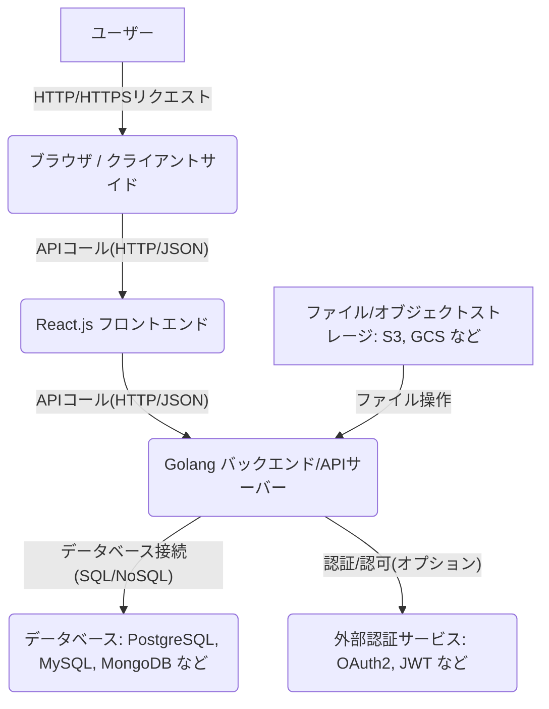

# WebCli
PC間のテキスト共有などのシステムを作る想定

# 構成イメージ
Geminiに聞いてだしたまんま

```mermaid
graph TD
    A[ユーザー] -->|HTTP/HTTPSリクエスト| B(ブラウザ / クライアントサイド)
    B -->|"APIコール(HTTP/JSON)"| C(React.js フロントエンド)
    C -->|"APIコール(HTTP/JSON)"| D(Golang バックエンド/APIサーバー)
    D -->|"データベース接続(SQL/NoSQL)"| E(データベース: PostgreSQL, MySQL, MongoDB など)
    D -->|"認証/認可(オプション)"| F(外部認証サービス: OAuth2, JWT など)
    G[ファイル/オブジェクトストレージ: S3, GCS など] -->|ファイル操作| D
```