# WebCli
PC間のテキスト共有などのシステムを作る想定


# 構成イメージ
Geminiに聞いてだしたまんま

```mermaid
flowchart TD
    %% === User / Frontend ===
    subgraph User["👩‍💻 User（ブラウザ）"]
    L[Login Page<br>（/login）]
    D[Dashboard Page<br>（/dashboard）]
    end

    %% === Frontend Logic ===
    subgraph React["⚛️ React App（フロントエンド）"]
    L -->|入力: email, password| FELogin[fetch（'/api/login'）<br>POST JSON]
    FELogin -->|認証成功: JWT Token 取得| SaveToken[localStorage に保存]
    SaveToken -->|Router Navigate| D
    D -->|fetch（'/api/user', JWT付き）| FEAPI
    end

    %% === Backend ===
    subgraph Backend["🖥️ GCE （Apache + Go API）"]

    subgraph Apache["🌐 Apache Web Server"]
        F[静的ファイル配信<br>/var/www/html]
        P[ProxyPass /api → localhost:8080]
    end

    subgraph GoAPI["⚙️ Go API Server （port:8080）"]
        A1[/api/login<br>POST/]
        A2[/api/user<br>GET/]
        D[（Database）]
    end
    end

    %% === Data Flow ===
    User -->|GET /login| F
    User -->|表示| L
    L --> React
    D --> React

    %% === Requests ===
    FELogin --> P
    P --> A1
    A1 -->|Check User in DB| D
    A1 -->|Return JWT| SaveToken

    FEAPI --> P
    P --> A2
    A2 -->|Verify JWT| D
    A2 -->|Return user data （JSON）| D
```


# 環境構築メモ

パッケージのアップデート
```
sudo apt update
sudo apt upgrade
```

Node.js のインストール
`sudo apt install nodejs npm`